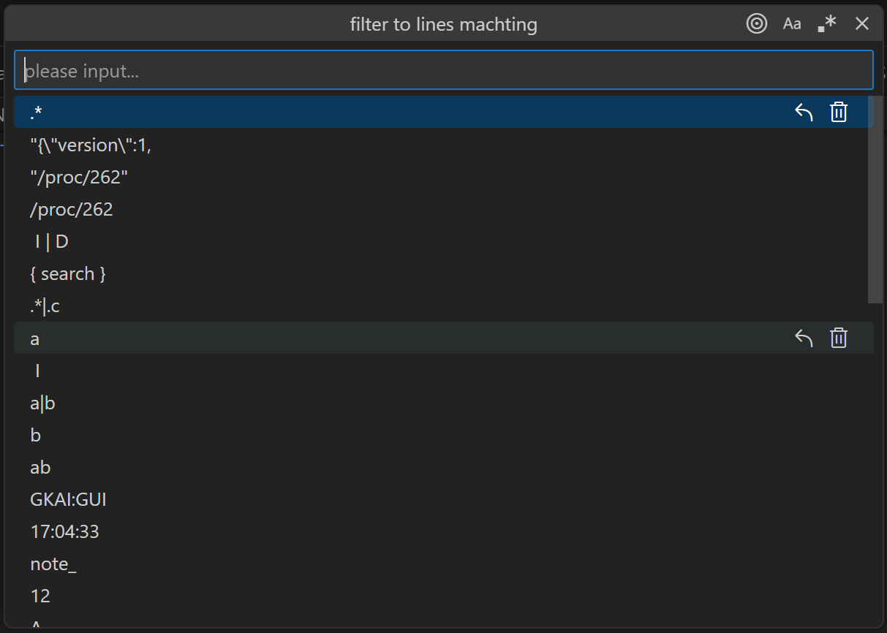
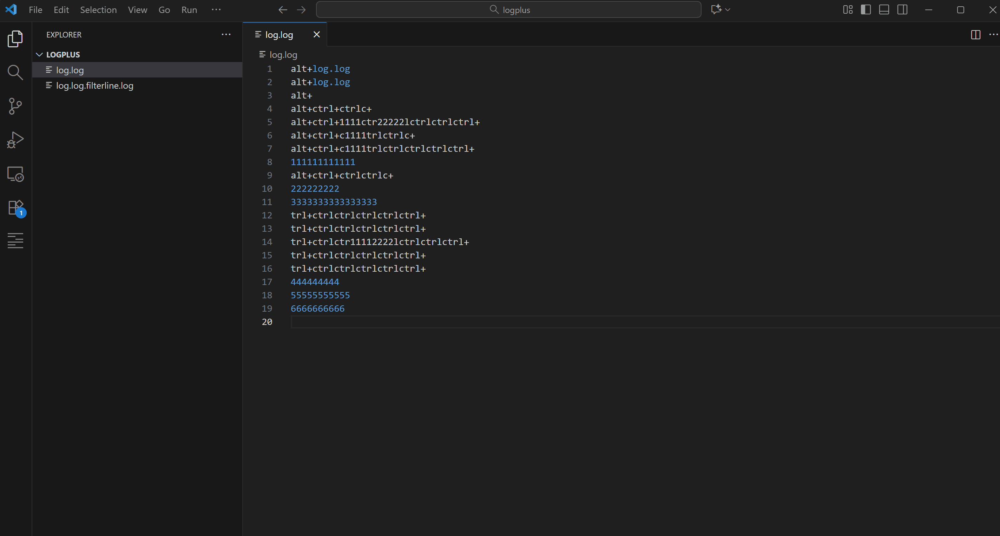
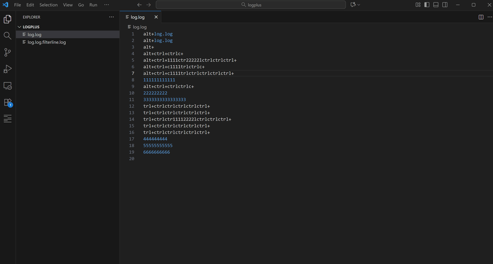

# VSCode Extension Filter Line

Filter line for current opening file by strings/regular expressions, generating the result in a new file.

## Usage
1. Alt + F: filter to lines machting
2. Alt + Shift + F： filter to lines not machting
2. F12：display surrounding lines of the selected target line
3. More：

## Features

1. Support large file filter
2. Support folder filte line
3. Filter line by input string (or not contain input string).
4. Filter line by input regular expression (or not match input regular expression).
5. Support showing context lines in the filter line view

### Large file mode
* Perfect support large file filter, but ensure the file is saved before proceeding.

### Support folder filte line.

### Filter line by input string.
1. Alt + F: filter to lines machting
2. Type a string and hit `<Enter>`.

### Filter line by input regex.
1. Alt + F: filter to lines machting
2. Type a regular expression and hit `<Enter>`.

### Support showing context lines in the filter line view.
1. Line currently targeted for selection
2. F12: Display surrounding lines of the selected target line

### Filter line by config file

1. Create config file in `.vscode` directory (e.g. `.vscode/filterline.json` or `.vscode/filterline.eoml`).
2. Edit the `filterline.json/.eoml` file to desired format.
3. Open command palette (⇧⌘p) and type `filterline`, select `Filter Line By Config File` in the list.

#### Config file type

1. There are 2 file types `filterline.json` and `filterline.eoml`. 
2. `eoml` is a simple config file format that created by me(`everettjf`), only for this project(`vscode-filter-line`) at present. For more information, please visit [eoml](https://github.com/everettjf/eoml).

#### Config file format type

There are 3 format types. As they are so simple, I will not describe them here. Please visit the demo directly :
1. `stringlist`: String list [json](demo/log0json/.vscode/filterline.json) or [eoml](demo/log0eoml/.vscode/filterline.eoml)
2. `regexlist`: Regular expressions list [json](demo/log1json/.vscode/filterline.json) or [eoml](demo/log1eoml/.vscode/filterline.eoml)
3. `general`: This is default if `type` is not specified. [json](demo/log2json/.vscode/filterline.json) or [eoml](demo/log2eoml/.vscode/filterline.eoml)

## Replacement

Command line replacement for this extension : [filterline](https://github.com/liangjunheng/vscode-filter-line)

